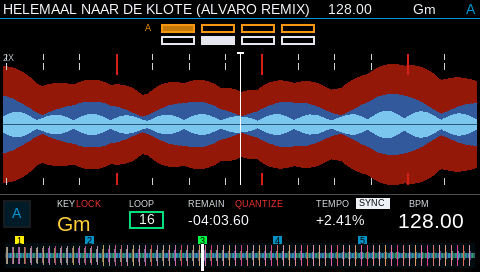

# Mixxx Traktor Kontrol D2 Bridge

An experimental Linux integration for using two Native Instruments Traktor Kontrol D2 units with Mixxx. It combines a libctlra-based hardware bridge, a 480x272 RGB565 player/browser renderer, Mixxx controller mappings, selected Mixxx source patches, and a two-deck XDJ100SX-derived skin.




## Current features

- Two physical D2 units with deterministic deck assignment
- Complete HID input to ALSA MIDI bridge
- PLAY/CUE state handling, Browse navigation, loop, beatjump, pads, FX and faders
- 480x272 RGB565 display output with independent rendering and complete-frame USB transfers
- Three-band waveform, overview, beat grid, phase meter, BPM, key, loop and hotcue state
- Dark Nexus-style browser with title, artist, BPM and key columns
- Mixxx controller JavaScript, MIDI XML and regression tests
- Recovery hook for reopening Mixxx after the bridge ALSA client changes

## Repository layout

- `bridge/`: C bridge, libctlra D2 driver and Mixxx analysis extractors
- `mixxx-controller/`: Mixxx JavaScript and MIDI XML mappings
- `mixxx-source-patches/`: source files/patches used by the custom Mixxx build
- `skin/XDJ100SX_2Deck/`: adapted two-deck Mixxx skin
- `systemd/`: startup and MIDI recovery integration
- `tests/`: Node-based controller regression tests
- `docs/`: current player and browser render captures

## Requirements

- Linux (tested on Raspberry Pi 5)
- Mixxx 2.5 custom source build
- libctlra and libusb
- ALSA sequencer development files
- FreeType and SQLite development files
- zlib and Protocol Buffers for Mixxx waveform/beat extractors
- Two Traktor Kontrol D2 devices

## Device configuration

The published driver does not contain physical device serial numbers. Export both serials before starting the bridge:

```sh
export D2_SERIAL_1="YOUR_FIRST_D2_SERIAL"
export D2_SERIAL_2="YOUR_SECOND_D2_SERIAL"
```

For systemd, place them in a private environment file and reference it from the service. Do not commit that file.

## Controller tests

Run from the repository root:

```sh
node tests/test_d2_mapping.js
node tests/test_d2_comprehensive.js
node tests/test_d2_complete_controls.js
```

Expected results:

```text
D2_MAPPING_TEST_OK
D2_COMPREHENSIVE_TEST_OK
D2_COMPLETE_CONTROLS_OK
```

## Important runtime detail

Keep `ctlra_idle_iter()` at a 10 ms interval. It also flushes LED feedback; running it at 2 ms can flood the HID output path and starve physical controller input. Screen rendering remains independent from this 100 Hz control loop.

## Status

This repository is a hardware-specific working snapshot and is still under active development. Back up an existing Mixxx/libctlra installation before applying source patches.

## Licensing and attribution

This project contains files derived from multiple upstream projects with different licenses. See [THIRD_PARTY_NOTICES.md](THIRD_PARTY_NOTICES.md) and the license files retained inside individual components before redistribution.

