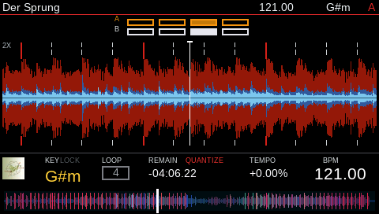
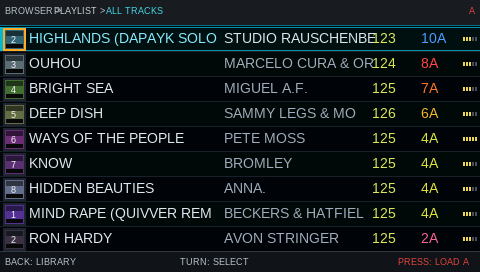
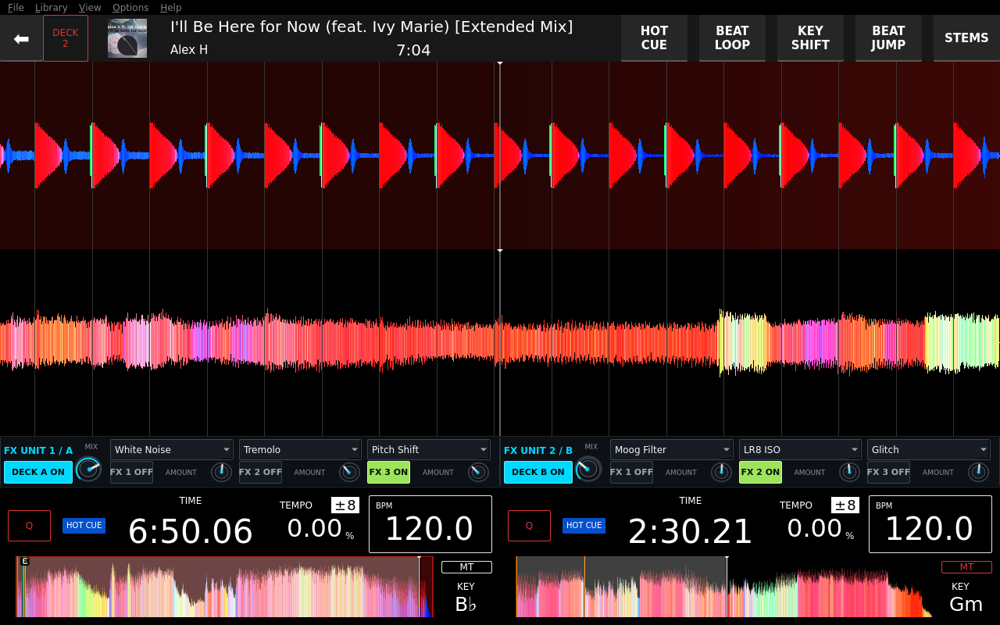
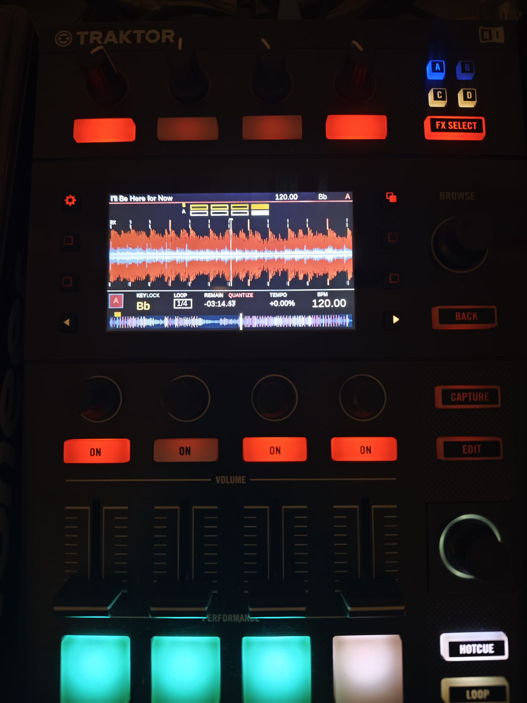
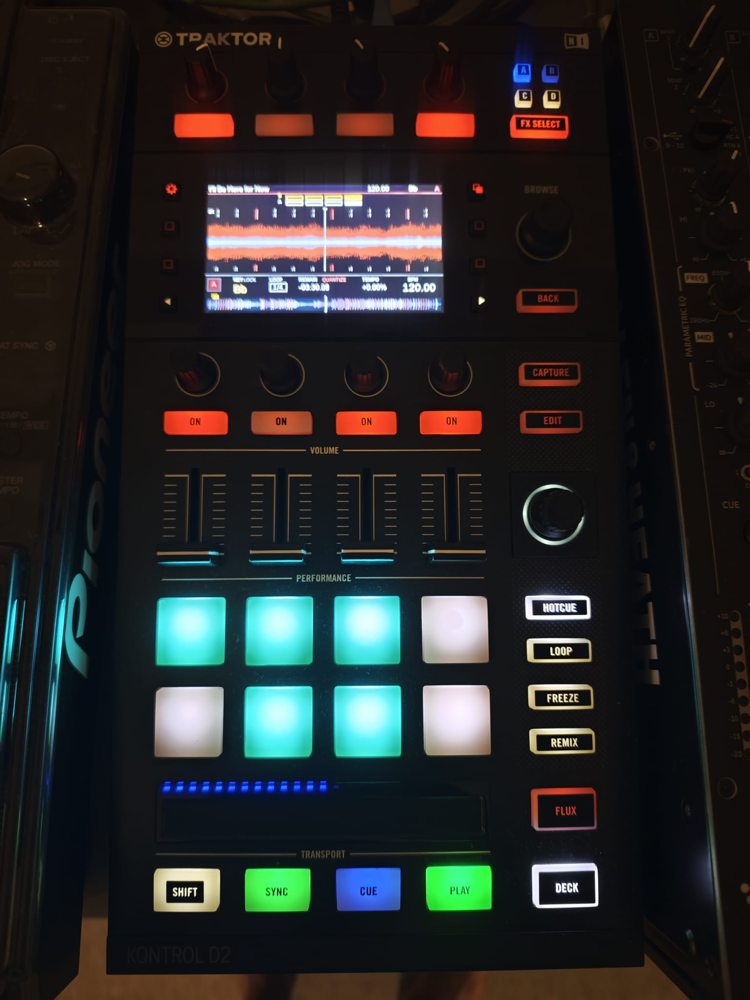
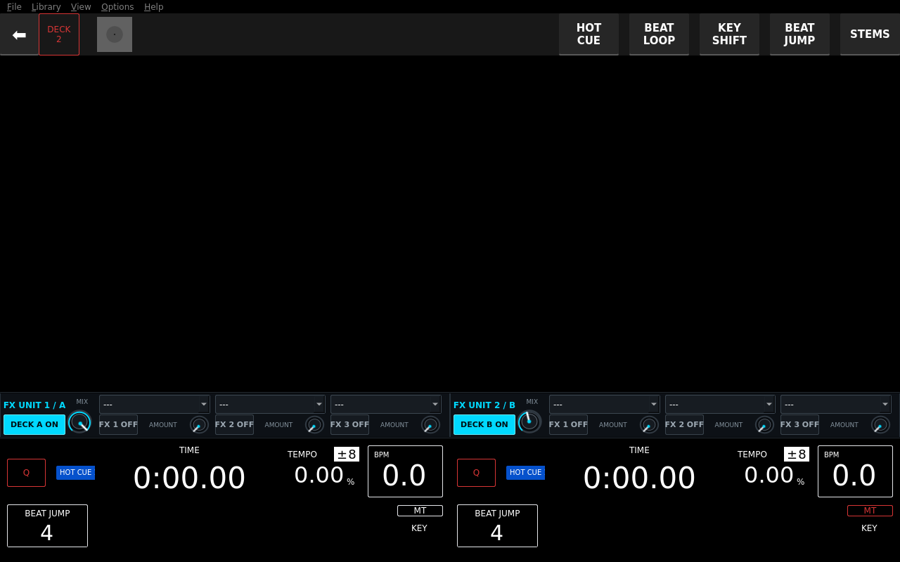
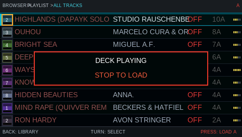
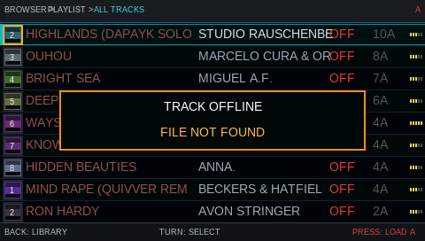

# Mixxx Nexus D2 — Dual Traktor Kontrol D2 Performance System

**Two D2s. One Mixxx system. Full hardware control, live three-band waveforms and custom 480×272 Nexus-style displays.**

An experimental Linux integration for using two Native Instruments Traktor Kontrol D2 units with Mixxx. It combines a libctlra-based hardware bridge, a 480x272 RGB565 player/browser renderer, Mixxx controller mappings, selected Mixxx source patches, and the custom two-deck `zed` skin derived from XDJ100SX.

## Screenshots

### Traktor D2 player



### Traktor D2 browser



### Mixxx zed two-deck player skin



### D2 hardware in action

<p align="center">
  
  
</p>

### Zed player FX controls



### D2 Browse safety feedback





## Current features

- Two physical D2 units with deterministic deck assignment
- Complete HID input to ALSA MIDI bridge
- PLAY/CUE state handling, Browse navigation, loop, beatjump, pads, FX and faders
- Live 4x2 D2 pad feedback for Loop, Roll/Freeze and Beatjump performance views
- 480x272 RGB565 display output with independent rendering and complete-frame USB transfers
- Three-band waveform, overview, beat grid, phase meter, BPM, key, loop and hotcue state
- Exact deck `track_id` identity for title, artist, file location, waveform and beatmap loading
- Dark Nexus-style browser with title, artist, BPM and key columns
- Browse-context sorting from the four left screen buttons: Title, BPM, Key,
  and ascending/descending order, with the active sort shown in the header
- Per-deck Zed FX bars backed by the same Effect Unit state as both D2s
- Live EffectManifest names on the D2 FX overlay (no numeric effect indexes)
- Mixxx controller JavaScript, MIDI XML and regression tests
- Recovery hook for reopening Mixxx after the bridge ALSA client changes

## Repository layout

- `bridge/`: C bridge, libctlra D2 driver and Mixxx analysis extractors
- `mixxx-controller/`: Mixxx JavaScript and MIDI XML mappings
- `mixxx-source-patches/`: source files/patches used by the custom Mixxx build
- `skin/zed/`: active two-deck Mixxx skin, derived from XDJ100SX
- `systemd/`: startup and MIDI recovery integration
- `tests/`: Node-based controller regression tests
- `docs/`: current player and browser render captures

## Requirements

- Linux (tested on Raspberry Pi 5)
- Mixxx 2.5 custom source build
- libctlra and libusb
- ALSA sequencer development files
- FreeType and SQLite development files
- zlib and Protocol Buffers for Mixxx waveform/beat extractors
- Node.js and Python 3 for the controller/skin regression suite
- Two Traktor Kontrol D2 devices

## Device configuration

The published driver does not contain physical device serial numbers. Export both serials before starting the bridge:

```sh
export D2_SERIAL_1="YOUR_FIRST_D2_SERIAL"
export D2_SERIAL_2="YOUR_SECOND_D2_SERIAL"
```

For systemd, place them in a private environment file and reference it from the service. Do not commit that file.

## Controller tests

Run from the repository root:

```sh
node tests/test_d2_mapping.js
node tests/test_d2_comprehensive.js
node tests/test_d2_complete_controls.js
node tests/test_d2_load_polling.js
node tests/test_d2_fx_roundtrip.js
python3 tests/test_time_display_modes.py
python3 tests/test_zed_fx_layout.py
```

Expected results:

```text
D2_MAPPING_TEST_OK
D2_COMPREHENSIVE_TEST_OK
D2_COMPLETE_CONTROLS_OK
D2_LOAD_POLLING_CONTRACT_OK
D2_FX_ROUNDTRIP_TEST_OK
TIME_DISPLAY_MODES_TEST_OK
ZED_FX_LAYOUT_TEST_OK
```

## FX controls

The Player page exposes Effect Unit 1 above Deck A and Effect Unit 2 above
Deck B. Each strip has a deck-route toggle, unit mix control and three native
Mixxx effect selectors with slot enable and meta controls. The main screen and
the D2 hardware therefore edit one authoritative Mixxx effect state.

The physical columns are fixed left-to-right as `MIX / FX1 / FX2 / FX3`.
The leftmost knob controls unit mix and its button routes the unit to its own
deck. The remaining three knobs control slot 1-3 meta values and their buttons
toggle those slots. Hold `SHIFT` and press a slot button to advance that slot
to the next visible Mixxx effect. `FX SELECT` opens/closes the four-column D2
settings overlay; D2 1 always owns Unit 1 / Deck A and D2 2 always owns Unit 2 /
Deck B. The overlay obtains each selected slot label from Mixxx's live
`EffectManifest::displayName()` and pixel-elides only names wider than 104 px.

## Native bridge build

The native bridge and both Mixxx-analysis helpers have a reproducible build
target. The defaults match the Raspberry Pi installation used by this project;
override `MIXXX_BUILD`, `CTLRA_ROOT` or `OUTPUT_DIR` when needed.

```sh
make -C bridge all
make -C bridge test-native
make -C bridge test-js
```

`make test-native` builds the bridge and extractors, then runs the protobuf
decoder self-test with a negative lead-in, the irregular BeatMap geometry
test and the complete native functionality contract. `make test-js` runs the
controller and skin/source regression suite. `make test` runs both groups and
therefore requires Node.js and Python 3. No target modifies `mixxxdb.sqlite`.

The bridge's metadata test can exercise the complete variable-tempo parser
without changing the Mixxx library:

```sh
chmod +x tests/fixtures/d2_fake_beatmap.sh
D2_BEATGRID_HELPER="$PWD/tests/fixtures/d2_fake_beatmap.sh" \
  ./d2_bridge_metadata --track-metadata-test 122
```

The expected status is `beatgrid=0 beatmap=1`. The environment override is
accepted only for an absolute, shell-safe helper path and is intended for
offline tests.

## Mixxx track identity patch

Apply `mixxx-source-patches/enginebuffer-track-id.patch` to the matching
Mixxx 2.5 source tree before building. It adds a read-only
`[ChannelN],track_id` Control Object and publishes it before `track_loaded`.
Also apply `mixxx-source-patches/controllerscriptinterface-track-location.patch`.
It adds `engine.getTrackLocation(group)` for restored/file-browser loads whose
temporary TrackPointer does not yet expose a valid library ID.
Apply `mixxx-source-patches/controllerscriptinterface-effect-name.patch` as
well. It adds the thread-safe `engine.getEffectName(effectSlotGroup)` string
snapshot used by the D2 FX overlay. The value comes from the actually loaded
manifest, so user-reordered visible effects, hidden effects, external plugins,
localized names and Mixxx short names do not rely on numeric index guesses.
Apply `mixxx-source-patches/wnumberpos-two-mode.patch` to make the dedicated
main-screen time widget toggle only between elapsed and remaining time. The
patch also normalizes the legacy combined-mode setting and updates its tooltip.
The controller sends that ID before `LOAD`; the bridge then resolves a single
`library.id` row and its exact `track_locations.location`. Track duration is
used only for normalized rendering and never for metadata selection. If the
ID is temporarily unavailable, the exact UTF-8 location is sent in 7-bit-safe
SysEx chunks and resolved with `track_locations.location = ?`.

The bridge also provides a non-USB verification path:

```sh
./d2_bridge_metadata --track-metadata-test 122
./d2_bridge_metadata --track-location-test "/absolute/path/to/track.mp3"
```

Use any valid local Mixxx track ID. The output reports the resolved location,
waveform source, cover-art status and beatgrid/beatmap status.

## Important runtime detail

Keep `ctlra_idle_iter()` at a 10 ms interval. It also flushes LED feedback; running it at 2 ms can flood the HID output path and starve physical controller input. Screen rendering remains independent from this 100 Hz control loop.

## Status

This repository is a hardware-specific working snapshot and is still under active development. Back up an existing Mixxx/libctlra installation before applying source patches.

## Licensing and attribution

This project contains files derived from multiple upstream projects with different licenses. See [THIRD_PARTY_NOTICES.md](THIRD_PARTY_NOTICES.md) and the license files retained inside individual components before redistribution.
