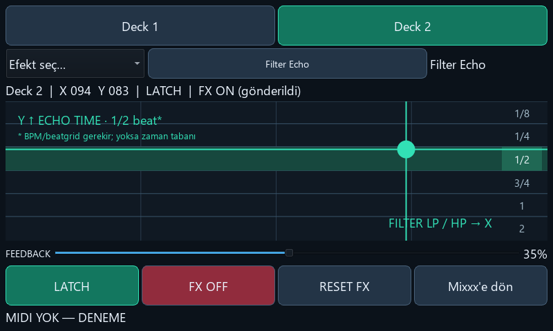
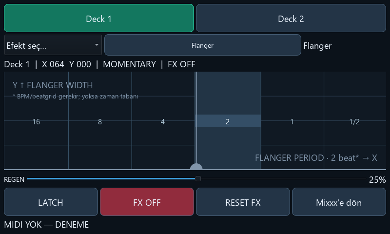
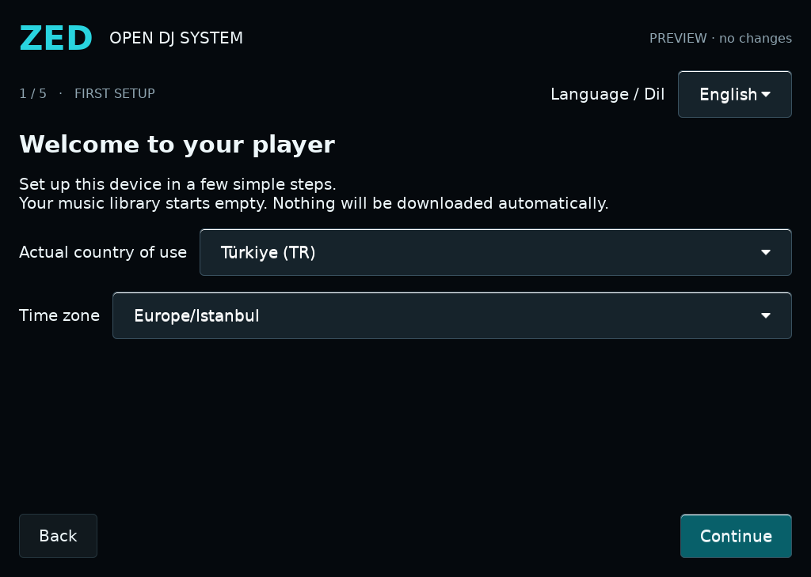

# ZED / September 2026 project update

This update publishes the Touch FX source overlay and screenshots.
It is not an OS download announcement. A verified local delivery package now
contains the owner-accepted clean image, corresponding sources and notices.
The personal NVMe remains separate and has not been uploaded.

## Touch FX

The [current application, mappings, integration and source tests](../integrations/touch-fx-source/README.md)
are included as an allowlisted source overlay. Its implementation hashes match
the accepted final Touch FX payload; no personal image or credentials are included.

The current ZED integration keeps two decks and the external-mixer workflow.
Touch FX uses X/Y macro parameter routing, a macro-specific amount slider,
momentary/latch operation, FX OFF and Reset FX. Beat-based controls show labeled
bands; LFO controls that use Hz are not advertised as phase-locked beat effects.

### Filter Echo

### Flanger

These are real PyQt widget captures rendered offscreen from the current source
at 800×480 with simulated MIDI feedback. They are not live Pi audio-test
captures. The visible dry-run label is intentionally retained; no image editing
or generated mock artwork was used. Captures contain no music library, device
access key, Wi-Fi password or personal device identifiers.

The macros approximate Filter Echo, Filter Reverb, Filter Roll/Glitch, LFO Echo,
Filter Dub Echo, Filter Gate/Tremolo, Noise Gate/Tremolo, Flanger, LFO Filter
and Filter using Mixxx effects. They do not contain another DJ product's DSP.

## First setup and audio selection

This is the existing offline setup-preview capture, not a new physical-device
test. Setup provides English/Turkish, country/time zone, Wi-Fi progression,
controller assignment and ALSA output selection. Generic ALSA selection does
not mean every mixer model is certified. The owner's accepted listening setup
uses two D2s and an XONE:96 with separate stereo deck outputs.

Other completed interface work includes restored cover art and the deck
selector positioned to its left, touch-friendly setup selection controls,
and device-settings navigation fixes. Optional uploads use a unique device key
on a trusted LAN; SSH is not enabled by the upload setting.

## Delivery status

The personal installation and the public OS distribution are distinct. The
personal image and its recovery USB must never be uploaded. The release staging
combines the accepted clean image, source archives, notices and EN/TR guides.
On 14 September a separate authenticated 923-package production OS was configured
with ZED, passed all nine installed-runtime smoke checks (including Qt widgets),
and produced an 8 GiB image with passing filesystem and privacy checks. A fresh
development OS also compiled Mixxx, D2 and the keyboard from the pinned sources.
Compilation, accepted-binary correspondence and image assembly are separately
recorded steps, not a claim of one-command or bit-identical image reproduction.

The local delivery deliberately retains the already hardware-tested image;
the new reconstruction is build evidence, not a silently substituted hardware
release. Firmware/font agreements, hardware restrictions, skin attributions and
complete source/notice distribution are documented alongside it. Historical
HOLD receipts remain unmodified. No OS image download is published by this commit.

The physical offline-admin recovery test now passes: local login and
password-authenticated sudo were verified on the Pi after recovery of a separate
test USB. That personalized USB is not a distributable artifact.

The remaining Mixxx binary difference was isolated to generated build-directory
metadata. Recompiling the version-information object with the canonical metadata
and relinking the verified portable-build objects produced a byte-identical
accepted executable. This correspondence experiment is not a complete fresh
OS/image build and does not change the accepted runtime.

This source/screenshot update contains no OS image, personal media, credentials,
Engine/PRIME4 firmware or associated proprietary artwork.
